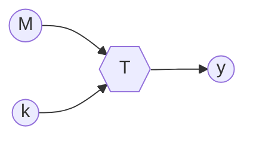
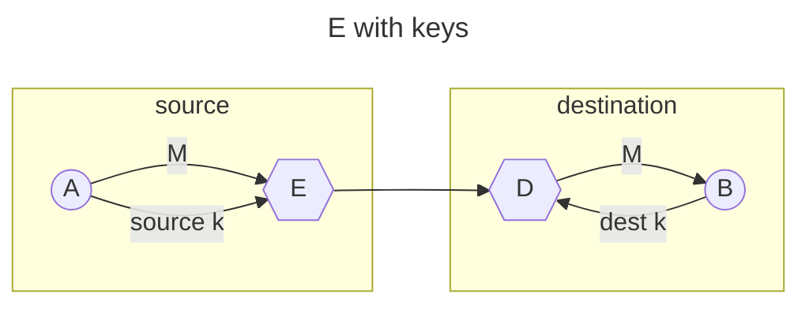
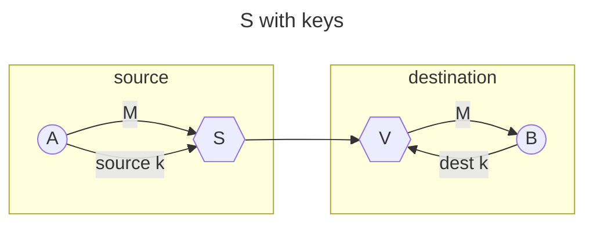

# CHIAVI

Le chiavi sono parametri che consentono di rendere [segrete](TRASFORMAZIONI.md#FUNZIONI%20SEGRETE) le trasformazioni per la sicurezza

In questo modo solo il possessore della chiave e in grado di riprodurre la trasformazione,e sempre possibile eseguire un attacco di forza bruta per risalire al valore della chiave ma la complessità computazionale del problema e **esponenziale in funzione della dimensione della chiave**

## IMPLEMENTAZIONE DI $E$ E $S$

Le trasformazioni [E](TRASFORMAZIONI.md#TRASFORMAZIONE%20$E$) e [S](TRASFORMAZIONI.md#TRASFORMAZIONE%20$S$) sono implementabili per mezzo dell' utilizzo di chiavi:

## RELAZIONI TRA LE CHIAVI

Le chiavi possono essere 

- **simmetriche** chiave della sorgente e della destinazione sono uguali o derivabili
- **asimmetriche**  chiave della sorgente e della destinazione sono diverse e in questo caso si parla di coppie di chiavi (*e.g. chiave pubblica/privata*)