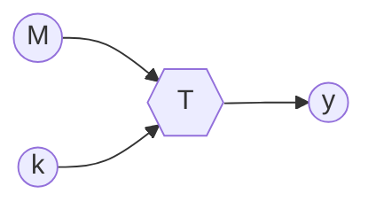
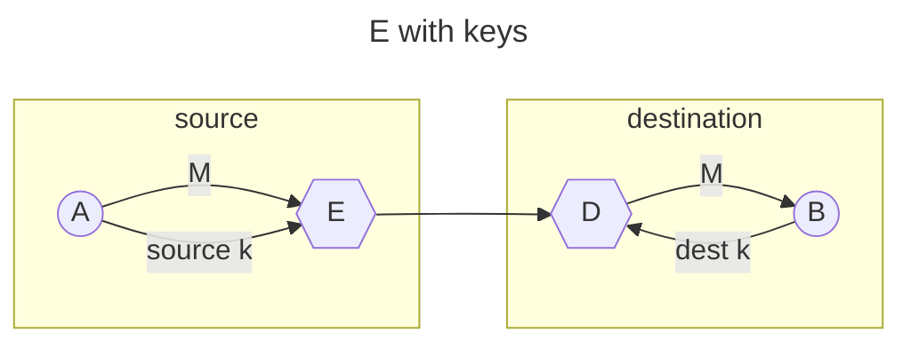
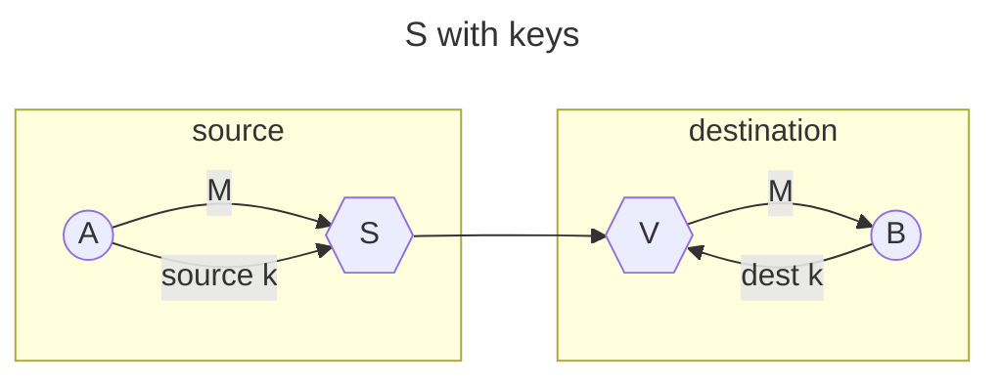
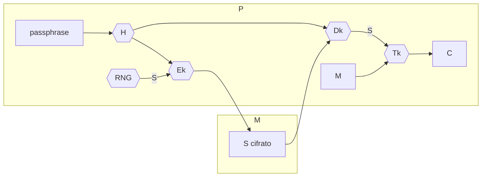

# CHIAVI

Le chiavi sono parametri che consentono di rendere [segrete](TRASFORMAZIONI.md#FUNZIONI%20SEGRETE) le trasformazioni per la sicurezza

In questo modo solo il possessore della chiave e in grado di riprodurre la trasformazione,e sempre possibile eseguire un attacco di forza bruta per risalire al valore della chiave ma la complessità computazionale del problema e **esponenziale in funzione della dimensione della chiave**

## IMPLEMENTAZIONE DI $E$ E $S$

Le trasformazioni [E](TRASFORMAZIONI.md#TRASFORMAZIONE%20$E$) e [S](TRASFORMAZIONI.md#TRASFORMAZIONE%20$S$) sono implementabili per mezzo dell' utilizzo di chiavi:

## RELAZIONI TRA LE CHIAVI

Le chiavi possono essere 

- **simmetriche** chiave della sorgente e della destinazione sono uguali o derivabili
- **asimmetriche**  chiave della sorgente e della destinazione sono diverse e in questo caso si parla di coppie di chiavi (*e.g. chiave pubblica/privata*)

### CHIAVI SIMMETRICHE

Le chiavi asimmetriche necessitano di una gestione accurata in quanto la sicurezza di un protocollo dipende dalla sicurezza delle chiavi stesse, la chiave simmetrica deve quindi essere **segreta** e **integra**

### CHIAVI ASIMMETRICHE

Per una coppia di chiavi asimmetriche devono essere garantite proprietà diverse a seconda della chiave:

- **chiave pubblica**: integrità autenticità
- **chiave privata**: riservatezza e integrità

Una caratteristica fondamentale e che dalla chiave pubblica non deve essere possibile risalire alla chiave privata (*e.g. la chiave pubblica deve essere generata da una [one way function](TRASFORMAZIONI.md#COSA%20SERVE%20PER%20RENDERE%20LE%20TRASFORMAZIONI%20SICURE?)*)

## AMMINISTRAZIONE DI CHIAVI

Per mantenere la riservatezza di una chiave e necessario un meccanismo che sia in grado di proteggerla da occhi indiscreti all' interno di un calcolatore

In questo schema la chiave viene generata per mezzo di un RNG, cifrata per mezzo della hash della passphrase e salvata in memoria, in fase di cifratura questa viene decifrata e utilizzata