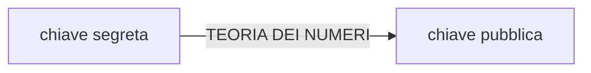
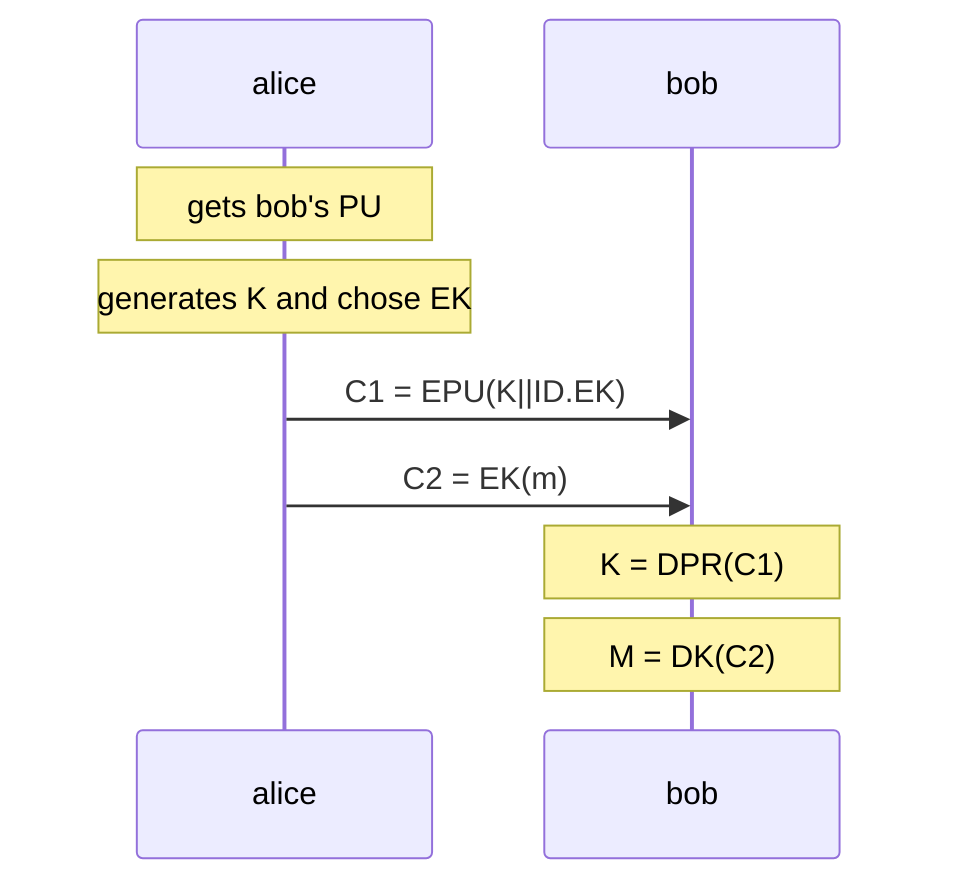

# CIFRARI ASIMMETRICI

In un cifrario asimmetrico le due entità posseggono entrambe una coppia di chiavi (*pubblica e privata*), possono essere utilizzati per garantire la confidenzialità (*cifrando con la pubkey del destinatario*) o l'autenticazione, (*cifrando con la privkey del mittente*).

Tutti i cifrari asimmetrici si basano su problemi difficili della teoria dei numeri per generare la chiave pubblica dalla privata in modo tale che sia computazionalmente difficile risalire alla privata dalla pubblica

## CIFRARIO IBRIDO

I cifrari asimmetrici possono essere utilizzati anche in soluzioni ibride per consentire a due entità di scambiare informazioni anche senza accordi precedenti

La sorgente sfrutta la chiave pubblica di bob per comunicare la chiave di sessione per effettuare poi una comunicazione per mezzo di [cifrari simmetrici](CIFRARI_SIMMETRICI.md#CIFRARI%20SIMMETRICI), l'algoritmo simmetrico viene scelto dalla sorgente

[PREVIOUS](CHIAVI.md) [NEXT](RSA.md)
