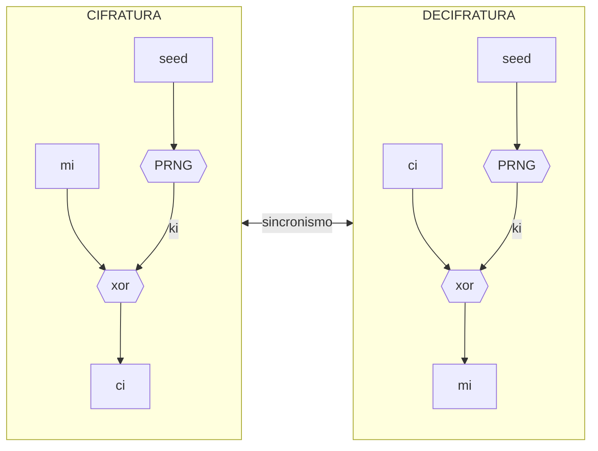
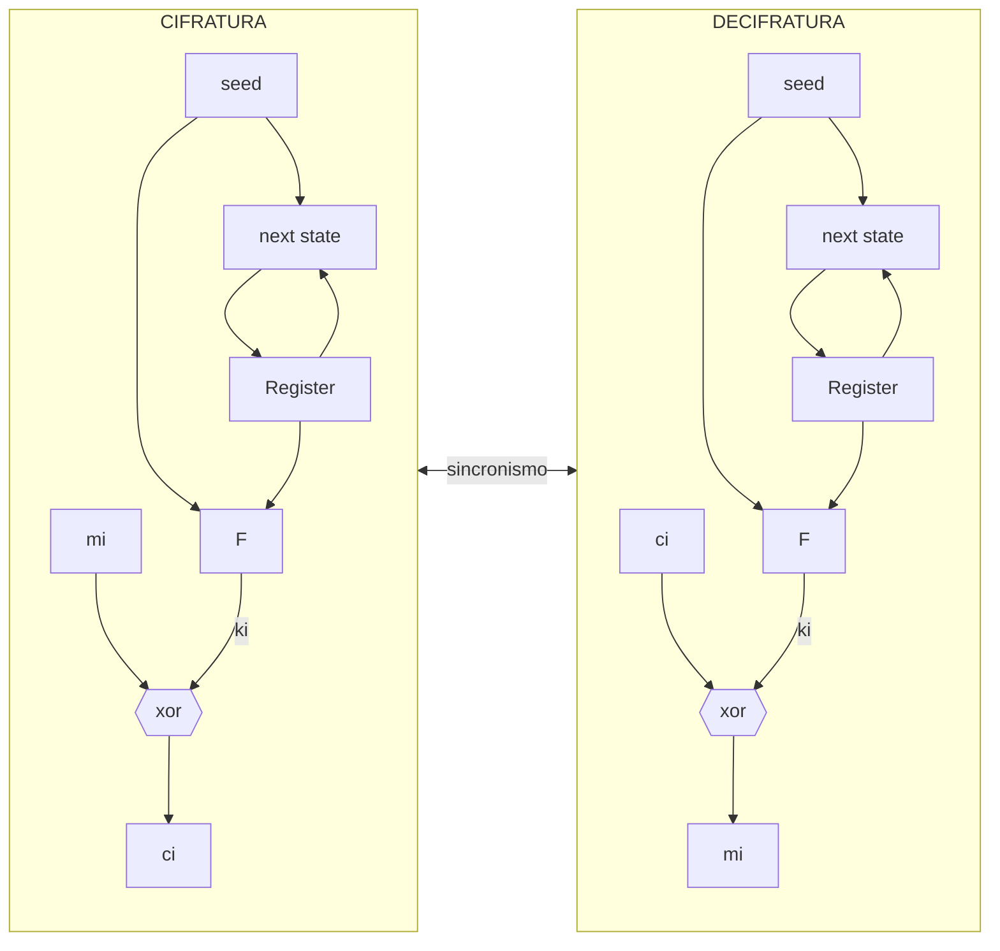
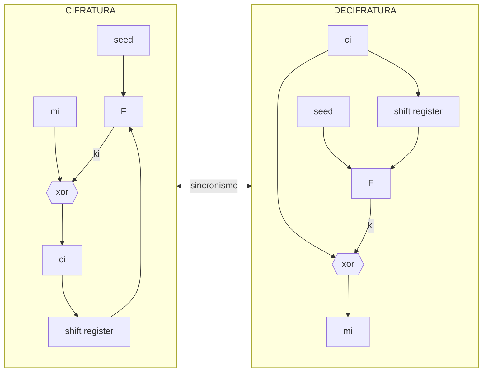
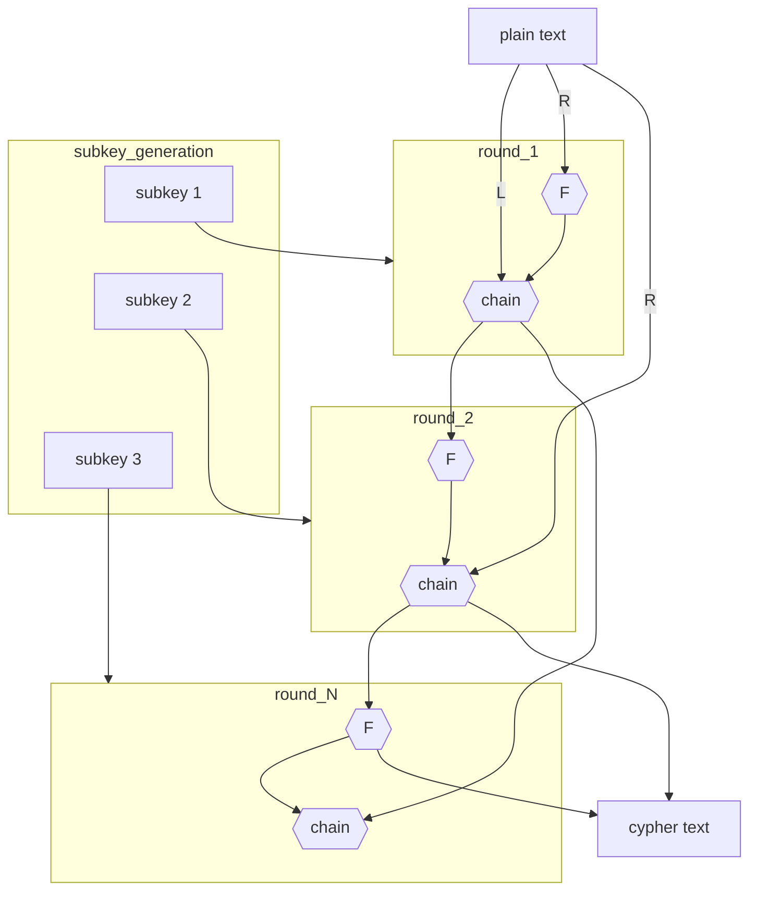

# CIFRARI SIMMETRICI

Cifrari che si basano su algoritmi simmetrici (*e.g. [chiavi simmetriche](CHIAVI.md#CHIAVI%20SIMMETRICHE)*). Nella costruzione dei cifrari simmetrici si seguono due principi fondamentali:

- **principio di Kerckof**: la sicurezza deve dipendere dalla chiave e non dall'algoritmo

- **confusione**: il messaggio cifrato non deve fornire informazioni sulla chiave (*es lunghezza*)

- **diffusione**: la modifica di un solo carattere nel messaggio in chiaro deve provocare una modifica sostanziale del messaggio cifrato

Possibili scopi di un cifrario simmetrico possono essere:

- garantire riservatezza
- costruire meccanismi di autenticazione del messaggio;
- per costruire protocolli di identificazione.

## CIFRARI A FLUSSO

Sono cifrari tipicamente utilizzati in applicazioni orientate al flusso di dati (*Esempio: protocollo wep, vecchio protocollo sostituito da vpa*), prendono in input un bit alla volta di testo in chiaro.

Un cifrario a flusso richiede l'utilizzo di [PRNG sicuri](RANDOM_NUMBER_GENERATOR.md#CRYPTOGRAPHICALLY%20SECURE%20PSEUDO%20RANDOM%20BIT%20GENERATOR%20(CSPRNG)) e la perfetta sincronia tra le due parti nell'effettuare la decifratura, inoltre essendo che si generano tanti bit di chiave quanti sono i bit del messaggio e necessario che il PRNG sia in grado di supportare un alto flusso di chiavi.

Un elemento fondamentale per la sicurezza dei cifrari a flusso e l' imprevedibilità del flusso di chiave, i PRNG anche se sicuri non possono garantirla per un periodo $T$ oltre una certa soglia.

Ci sono 2 famiglie di cifrari a flusso:

### CIFRARI A FLUSSO SINCRONO

Cifrari che richiedono necessariamente la sincronia del flusso di chiave

### CIFRARI AUTO SINCRONIZZANTI

Cifrari in cui il testo cifrato viene utilizzato in retroazione in uno shift register

## CONFRONTO

Per entrambi i cifrari non e possibile un attacco passivo, a patto di utilizzare PRNG sicuri, tuttavia sono vulnerabili ad attacchi attivi,

Sono però vulnerabili ad attacchi attivi. Se il flusso dei dati viene alterato è impossibile effettuare una decifrazione corretta. Ci chiediamo quali sono gli effetti a seguito di un attacco cattivo nei tre casi: cancellazione, modifica di un bit testo cifrato o inserimento di un bit.

|                                 | CANCELLAZIONE                                                                                  | INSERIMENTO                                                                                    | MODIFICA                                                                                       |
| ------------------------------- | ---------------------------------------------------------------------------------------------- | ---------------------------------------------------------------------------------------------- | ---------------------------------------------------------------------------------------------- |
| **CIFRARIO A FLUSSO SINCRONO**  | perdita del sincronismo, comunicazione interrotta                                              | perdita di sincronismo, comunicazione interrotta                                               | il bit modificato non viene decifrato ma la comunicazione procede                              |
| **CIFRARIO AUTOSINCRONIZZANTE** | la decifrazione e temporaneamente interrotta fintanto che il bit non esce dallo shift register | la decifrazione e temporaneamente interrotta fintanto che il bit non esce dallo shift register | la decifrazione e temporaneamente interrotta fintanto che il bit non esce dallo shift register |

## RIUTILIZZO DELLE CHIAVI

La sicurezza di questi cifrari dipende dalla sicurezza delle chiavi utilizzate, in questo caso, visto che viene effettuata l'operazione di xor si ha che:

$$
\displaylines{
m_1 \oplus k = c_1 \\
m_2 \oplus k = c_2 \\
c_1 \oplus c_2 = m_1 \oplus m_2
}
$$

L'attaccante può dunque **dedurre informazioni da chiavi riutilizzate**

## CIFRARI A BLOCCHI

Cifrari che prendono in input blocchi sufficientemente grandi di bite applicando ad essi trasformazioni (*e.g. sostituzione*) per ottenere il cifrato, lo scenario di utilizzo tipico e quello di store and forward (*e.g. file, pacchetti*)

il testo in chiaro viene suddiviso in blocchi ai quali viene applicata la **stessa trasformazione**, in questo scenario ci sono importanti parametri di cui tenere conto:

- dimensione della chiave
- utilizzo del padding nei blocchi
- dimensione dei blocchi

### RETE DI FEISTEL

La maggior parte dei cifrari a blocco si rifanno al **modello della rete di Feistel**

Un blocco di testo viene suddiviso in due parti che alimentano il primo round di trasformazione, la parte destra subisce la trasformazione $f$ e viene concatenata con  la parte sinistra, le due parti vengono poi invertite e vanno ad alimentare il blocco successivo. Ogni trasformazione $f$ e dettata dalla sottochiave di riferimento dello stage generate a partire dalla chiave di cifratura originaria

Gli algoritmi che si rifanno a questo modello devono definire i seguenti parametri

- dimensione dei blocchi
- numero di iterazioni
- funzione $f$
- algoritmo di generazione delle sotto chiavi

### IMPLEMENTANDO LA RETE DI FESTEL: DES

Una delle prime implementazioni della rete di Festel e DES, prevede 16 iterazioni, i blocchi sono di 64 bit e la chiave di 56bit. Algoritmo robusto ma vulnerabile per la dimensione della chiave

### AES

Algoritmo di cifratura a blocchi standard del settore, utilizza operazioni di sostituzione e trasposizione ma non si rifa alla rete di festel

[PREVIOUS](MODALITA_CIFRATURA.md) [NEXT](PROTOCOLLO_WEP.md)
