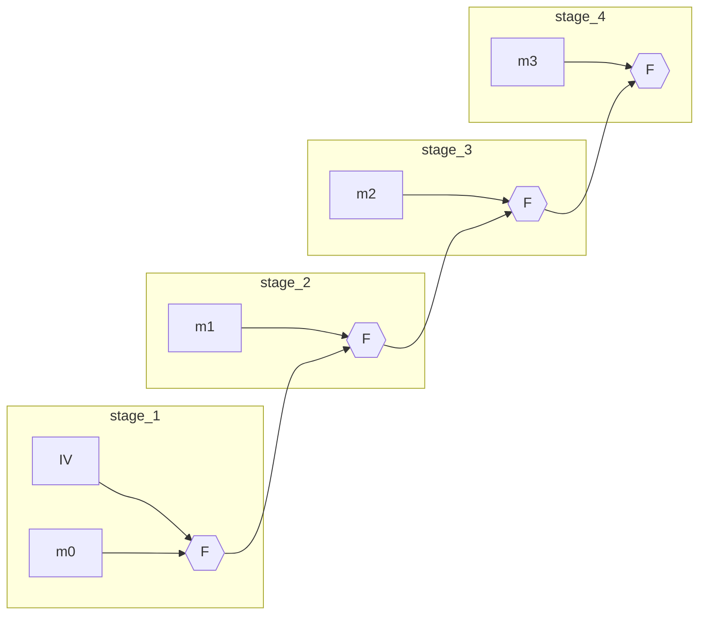
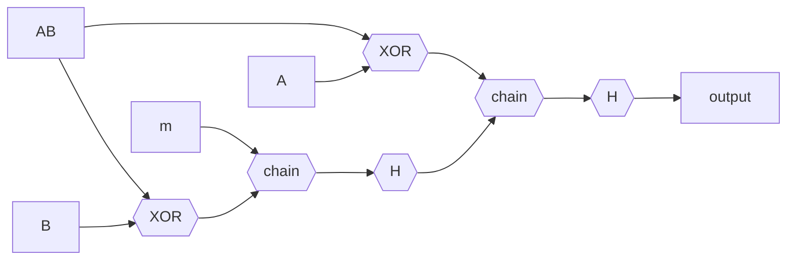

# FUNZIONI HASH

Una funzione hash deve presentare le seguenti proprietà:

-   **Efficienza**: il calcolo di H(x) deve essere facile per ogni x
-   **Robustezza debole alle collisioni**: per ogni x deve essere infattibile trovare una y diversa da x tale che H(y)=H(x)
-   **Robustezza forte alle collisioni**: deve essere infattibile trovare una qualsiasi coppia y,x tale che H(y)=H(x)
-   **Unidirezionalità**: per ogni $h$ deve essere infattibile trovare un $x$ tale che $H(x)=h$

## COMPRESSIONE ITERATA (CI)

E possibile implementare una funzione di hash con il seguente schema di compressione iterata (*scelta comune a molti algoritmi di hash*)

il messaggio viene suddiviso in blocchi e compresso insieme all'output della compressione precedente, il primo stage viene inizializzato con un vettore random. in questo schema **le proprietà della funzione hash dipendono dalla funzione $f$ di compressione**

### ROMPERE LA COMPRESSIONE ITERATA: ATTACCO CON LENGTH EXTENSION

In uno scenario dove l'[autenticazione e implementata per mezzo della funzione hash](PROTOCOLLI.md#HASH%20DI%20UN%20SEGRETO), la compressione iterata consente all' attaccante di generare messaggi e valori di hash validi senza conoscere il segreto $S$ quando il messaggio inviato sul canale e della forma:

$$ m|H(S|m)$$

In questo caso l'attaccante può sfruttare il fatto che la funzione $f$ e nota e generare un $m^*$ composizione del messaggio originale con un pezzo aggiuntivo a piacere e la funzione hash risultate e 

$$f(H(m),m^{'})||H(s|m)$$

### POSSIBILI CONTROMISURE: PADDING

Un modo per arginare questo attacco e incrementare il contenuto informativo del messaggio (*e.g. usare padding o message length*).

### POSSIBILI CONTROMISURE: IMPRONTA DI IMPRONTA

Un'altra possibile contromisura e l'impronta di un impronta, ne esistono diverse varianti qui si riporta HMAC meccanismo utilizzato da IPSEC e SSL

In questa iterazione il segrato $AB$ viene posto in xor a due valori costanti che poi vengono sottoposti a funzione hash

## RESISTENZA ALLE COLLISIONI

Questa proprieta e fondamentale per l'utilizzo della funzione hash negli scenari di [firma digitale](PROTOCOLLI.md#FIRMA%20DIGITALE) in cui viene intrapresa la firma dell' hash di un messaggio.

Se infatti non valesse la proprieta di resistenza alle collisioni l'attaccante potrebbe generare un testo $m^*$ tale per cui $H(m)=H(m^*)$ e indurre la sorgente a firmare un testo a lei non favorevole

## UNIDIREZIONALITÀ

Questa proprieta e fondamentale per 2 motivi:

- protocolli che prevedono l'hash di segreti. 
- impedire a un attaccante con un attacco di forza bruta di generare un messaggio e farlo apparire come firmato legittimamente da una sorgente

## ALGORITMI DI HASH BASATI SU CI

|                              | MD5       | SHA-1       | RIREMD-160 |
| ---------------------------- | --------- | ----------- | ---------- |
| **digest length**            | 128 bits  | 160 bits    | 160 bits   |
| **Basic unit of processing** | 512 bits  | 512 bits    | 512 bits   |
| **number of steps**          | 64        | 80          | 160        |
| **maximum message size**     | unlimited | 2^64-1 bits | unlimited  |

## FUNZIONI HASH SICURE E COMPLESSITÀ COMPUTAZIONALE

Per far si che la funzione hash risulti sicura deve valere la resistenza forte alle collisioni:

*data una funzione $H(x)$ e $k$ input casuali quanto deve essere grande $k$ per far si che  la probabilità che almeno un $y$ tale per cui $H(y)=H(x)$ sia minore di $0.5$ ?*

applicando il teorema binomiale si scopre che la probabilità di successo e di $2^{n}$ ergo una complessità esponenziale

### ATTACCHI A HASH NON RESISTENTI ALLE COLLISIONI

Una possibile modalita per attaccare la resistenza debole e il seguente:

- L'attaccante prepara 2 versioni di un contratto $M$ ed $M'$ di cui una e favorevole alla sorgente e l'altra no
- modifica $M'$ a caso finchè $H(M)= H(M')$
- la sorgente firma $M$ 
- l'attaccante ha una firma valida per $M'$

Per far si che l'attacco riesca, sono necessari $2^{n/2}$ tentativi 