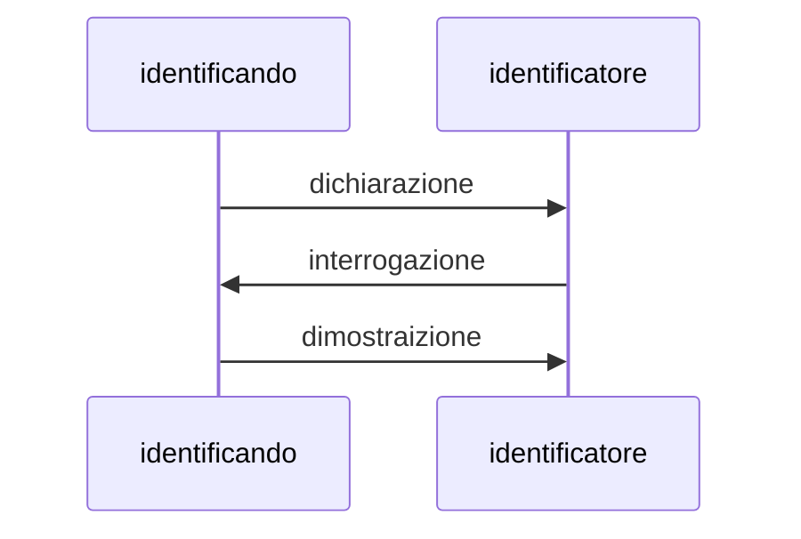
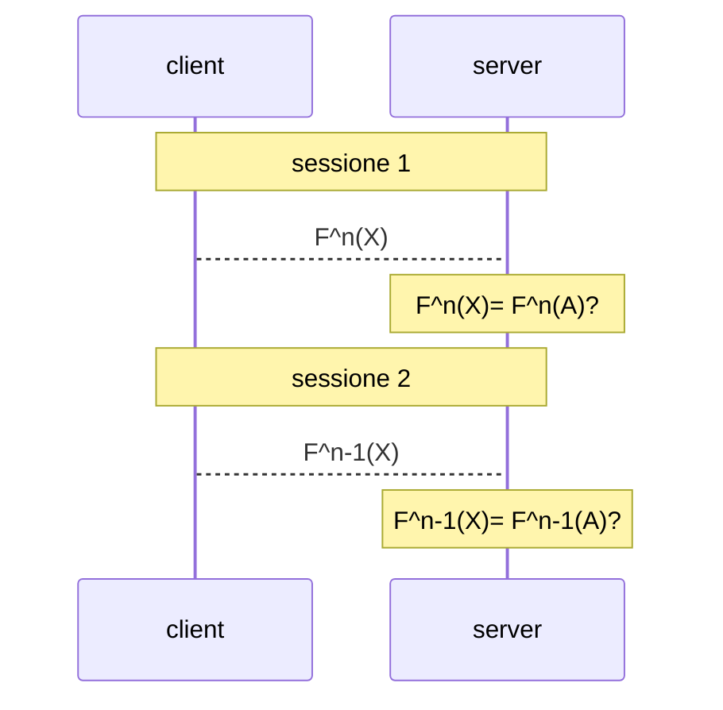
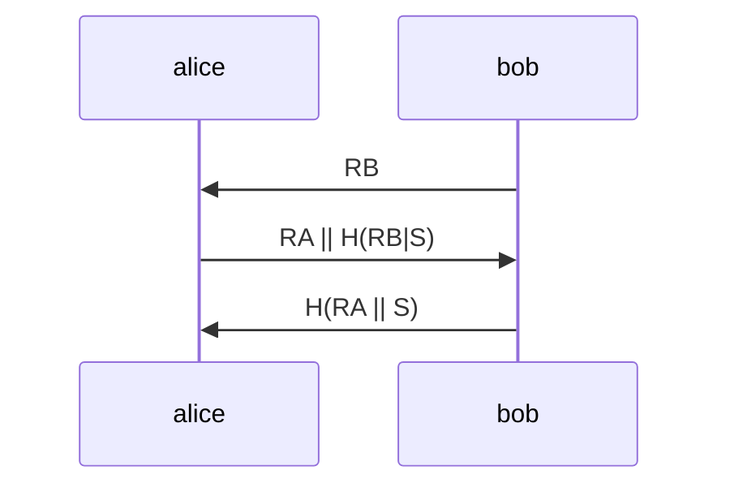
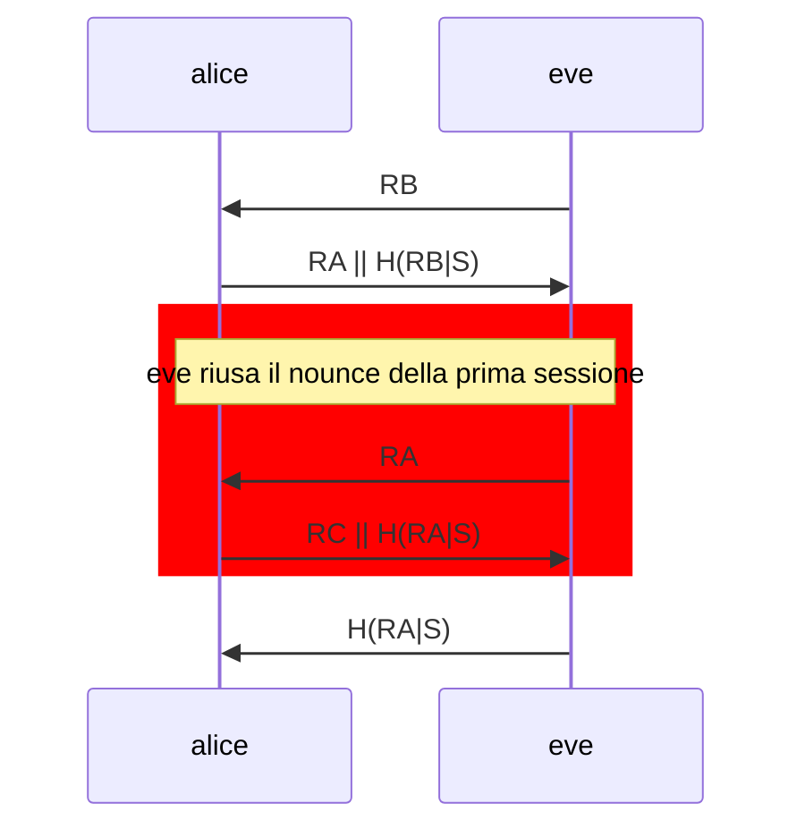

# IDENTIFICAZIONE

Esistono applicazioni che richiedono l'anonimato, altre che necessitano dell'anonimato. Nella maggioranza dei casi è però **richiesto che l'erogatore di un servizio conosca l'identità di chi ne usufruisce e che il fruitore sia certo dell'identità dell'erogatore** 

Il protocollo di identificazione e una **soluzione real-time** e l'informazione che ne scaturisce ha **validità istantanea**

## MODALITÀ DI IDENTIFICAZIONE

Le possibili dimostrazioni di identita che un utente puo fornire sono 3:

-   **conoscenza di un segreto** (*pin, psw, key*)
-   **possesso di un segreto** (*token, banda magnetica, smart card*)
-   **conformità** (*riconoscimento fisiologico o comportamentale*)

## PROTOCOLLO DI IDENTIFICAZIONE

Per un'identificazione sicura vale la seguente regola:

*tramite il solo scambio di messaggi, l'Entità che vuole farsi riconoscere deve fornire informazioni non imitabili, atte ad individuarla univocamente in quel preciso istante di tempo, e l'Entità che effettua il riconoscimento deve potersi convincere della loro genuinità*

In un protocollo di identificazione le entità coinvolte sono sempre due:
- identificando
- verificatore

Due sono i momenti topici, o fasi, di un processo d'identificazione:

- **registrazione**: in questa fase le due parti concordano un segreto S
- **riconoscimento**: in questa fase l'identificando richiede all verificatore di essere identificato

### FASE DI RICONOSCIMENTO

Il verificatore sa se il verificando è chi dice di essere solo al termine della terza fase.

### CONSIDERAZIONI

La robustezza del protocollo si basa sul fatto che la dimostrazione e una procedura computazionalmente difficile che non deve permettere a un attaccante di risalire al segreto utilizzato

## CLASSIFICAZIONE

I protocolli di identificazione possono essere classificati in 2 tipologie:

- **protocolli passivi**: il segreto e sempre uno e invariato in tutte le sessioni di identificazione (*e.g. identificazione con password*)
- **protocolli attivi**: il segreto utilizzato cambia a ogni sessione di identificazione, in questa tipologia ricadono OTP, sfida risposta,e protocolli zero knowledge

## PROTOCOLLO ONE TIME PASSWORD (OTP)

Protocollo basato su una funzione nota $F(x)$ one-way che le due parti conoscono, quando un utente vuole identificarsi invia al server l'output di $F^n(x)$ e a ogni identificazione la funzione scala di un esponente 

## PROTOCOLLO SFIDA RISPOSTA

In questo protocollo il server sfida il client a generare un messaggio che solo colui con cui il segreto e stato concordato e in grado di generare:

### ATTACCO DI REFLECTION

I protocolli sfida e risposta sono vulnerabili all'attacco di reflection.

In questa tipologia di attacco l'utente malevolo apre due sessioni con alice e sfrutta la seconda sfida come risposta alla prima riproponendo il numero random fornito da alice alla prima sessione

### EVITARE LA REFLECTION: ROMPERE LA SIMMETRIA

Ci sono diverse soluzioni volte a impedire l'attacco di reflection, tutte si basano sul rompere la simmetria del protocollo sfida risposta:

- **numeri random**: in questa soluzione l'identificatore deve mantenere dello stato temporaneamente fino al termine della sessione
- **numeri di sequenza**: necessario mantenere lo stato a lungo termine, molto oneroso
- **timestamp**: necessario accordarsi in maniera sicura su un tempo globale