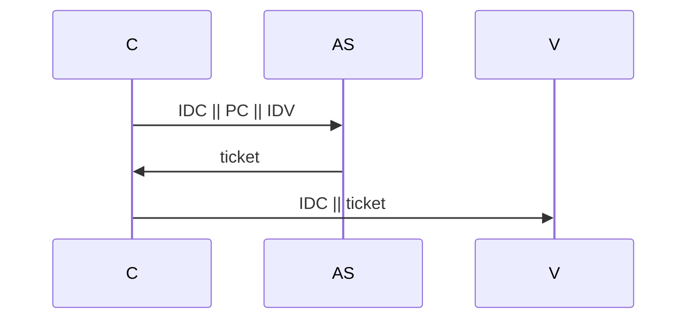
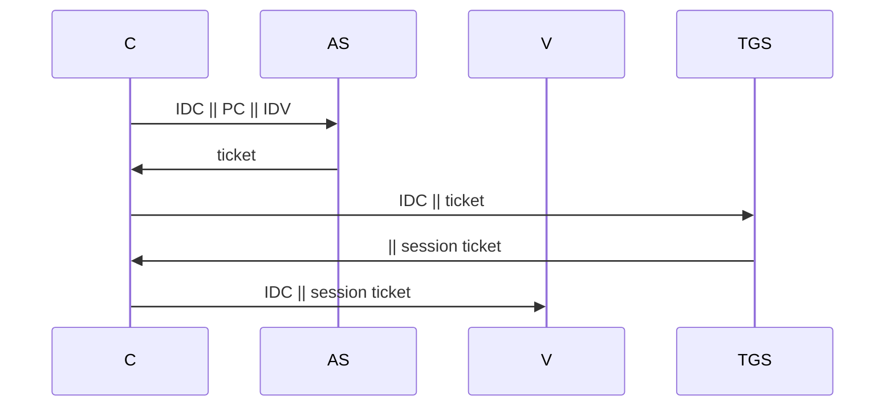

# KERBEROS

Servizio di autenticazione centralizzato per un accesso a un pull di workstation e differenziare accesso in base agli utenti.

Kerberos garantisce le seguenti funzionalità:

- Previene l'impersonificazione
- Limita la possibilità per un utente di alterare l’indirizzo IP di una workstation
- Evita possibili attacchi con replica

## PROTOCOLLO

Il protocollo avviene fra tre entita, il server fidato il client e il fornitore del servizio

Uno dei problemi fondamentali con questa versione del protocollo e evitare attacchi di replica, inoltre ad ogni comunicazione con la destinazione e necessario ripetere la procedura di autenticazione

i problemi sopracitati possono essere compensati introducendo un elemento architetturale che si occupi di lasciare ticket di sessione per mezzo di ticket con tempo di validita:

## DOMINI MULTIPLI

In caso di domini multipli gestiti da più TGS e AS si predispongono delle relazioni di fiducia tra i vari AS  basati su chiavi pre condivise in modo da erogare il servizio a utenti diversi da quelli del proprio dominio