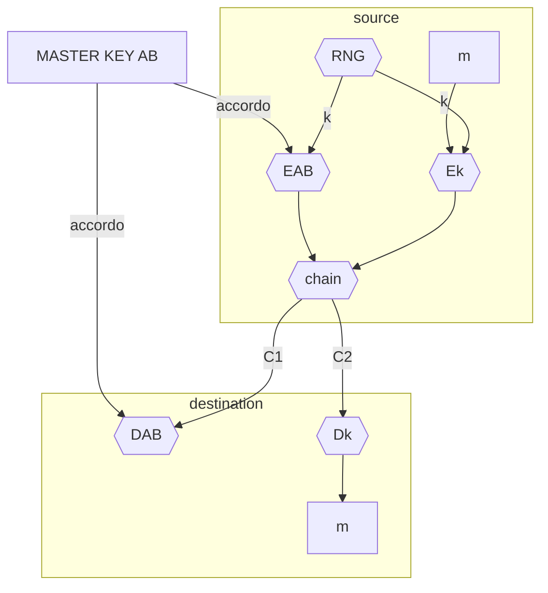
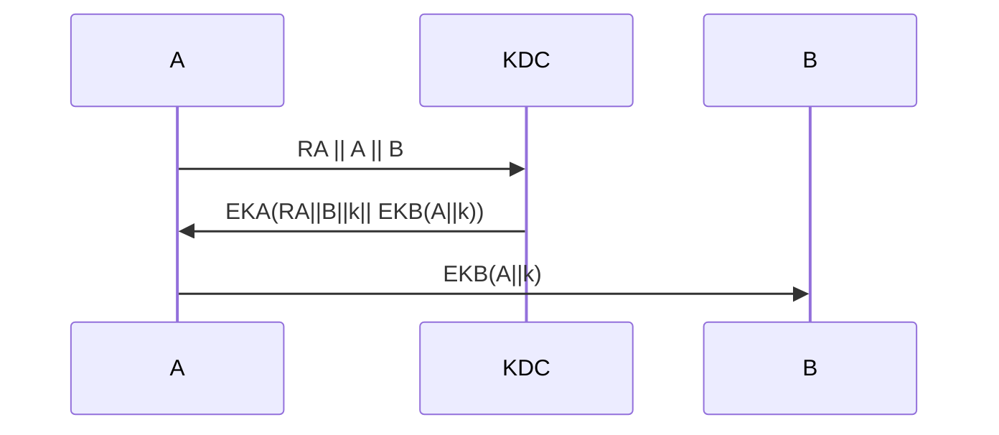
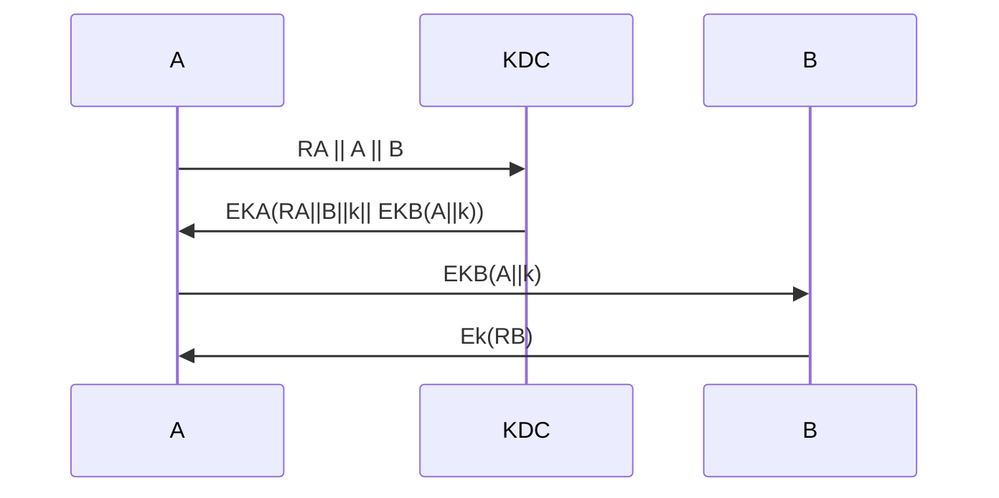

# MECCANISMO DI DISTRIBUZIONE DELLE CHIAVI

Nei [cifrari simmertrici](CIFRARI_SIMMETRICI.md#CIFRARI%20SIMMETRICI) e fondamentale stabilire come distribuire la chiave agli interessati alla comunicazione, ci sono due modelli di interazione principali

- scambio su canale sicuro ([master key](#MASTER%20KEY), [key distribution center](#KEY%20DISTRIBUTION%20CENTER%20(KDC)))
- segreto concordato per mezzo di internet ([diffie_hellman](DIFFIE_HELLMAN.md),[cifrari_asimmetrici](CIFRARI_ASIMMETRICI.md))

## MASTER KEY

Le due parti concordano una chiave su canale sicuro, per evitare di scambiare molti testi cifrati con la stessa chiave, la **master key non viene usata per cifrare i messaggi ma delle chiavi di sessione**, queste chiavi hanno durata limitata e vengono usate per cifrare i messaggi

La chiave di sessione viene generata dal mittente e inviata sul canale insicuro cifrata per mezzo della MASTER KEY, la destinazione la usa per decifrare i messaggi di una data sessione

### MASTER KEY E  SCALABILITÀ

Una sola master key condivisa non si presta bene a situazioni con alto numero di utenti dove il numero di chiavi da distribuire scala secondo $N^2$ 

## KEY DISTRIBUTION CENTER (KDC)

Soluzione che cerca di risolvere il problema di scalabilità della master key introducendo una terza entità il KEY DISTRIBUTION CENTER, i membri della rete concordano con il KDC una master key e quando un mittente vuole intraprendere una comunicazione chiede la master key del destinatario e fornisce al KDC la chiave di sessione.

In questo esempio A si identifica con KDC e mette B in grado di decifrare la comunicazione.

L'attaccante non puo risalire a Ka o KB pero puo effettuare attacchi di replay con il 3 messaggio dato che B non esegue una procedura di identificazione con A, questo puo essere fatto per ottenere le seguenti infromazioni:

- campioni di testo cifrato da analizzare
- intraprendere comunicazioni con B qual'ora l'attaccante sia risalito a k

2 possibili mitigazioni

- B tiene traccia delle chiavi utilizzate (*molto costoso*)
- B sfida il mittente del terzo pacchetto a identificarsi

### PROBLEMATICHE DI UN KDC

Le soluzioni con un KDC hanno delle problematiche intrinseche:

- il KDC **single point of failure**
- il KDC deve essere un elemento fidato per tutti i membri della rete

Per sopperire al problema del collo di bottiglia si puo sfruttare il principio di localita dove un KDC si occupa di una porzione ristretta della rete (*e.g. DNS*) e stabilire relazioni di fiducia tra i vari KDC

### **Schema KDC alternativo**

	Questo è un esempio di protocollo senza vulnerabilità.

Come nell’altro caso c’è un DoS: se attacco A devo riniziare la comunicazione, se attacco B la procedura non termina.

I n presenza di richieste molteplici T è sempre collo di bottiglia come nel caso precedente. In questo caso però T è maggiormente sovraccaricata. In quanto nel KDC classico la terza parte fa solo 2 trasformazioni, in questo caso devono essere effettuate due decifrazioni in più.

A deve effettuare un’operazione in meno rispetto a prima. B ha 2 operazioni da fare: cifratura di Kb, decifrazione del messaggio mandatogli da T.

Nel primo caso era compito di A attivare la comunicazione e prendere k da T, in questo caso è B. Quindi si ha un’inversione di ruoli.

Quindi la scelta tra i due meccanismi dipende dalla tipologia di dispositivo personalizzato da A e B.

Ipotesi: implementiamo il modello

Visto che in gioco ci sono informazioni aleatorie, potremmo decidere di implementare ECB. Ci sono dei casi in cui il modello di cifratura può dare luogo a qualche problema?

Non ammette attacco con replica perché ogni chiave di sessione k è dipendente dai numeri random.

Se il KDC usa ECB come modalità di cifratura simmetrica possiamo ipotizzare che ogni dato occupi un blocco. In questo caso l’attaccante può sostituire il blocco Eka8k) con Eka(k’) conosciuto, lasciando gli altri Eka(B) e Eka(Ra) invariati

### **Uso del vettore IV**

- CBC, CFB e OFB richiedono un vettore IV ad ogni operazione di cifratura
    
- IV non deve essere necessariamente segreto
    
- Per CBC e CFB IV necessariamente imprevedibile
    
- In OFB IV non deve essere necessariamente imprevedibile ma unico
    

## **Integrità e confidenzialità**

E ora che conosciamo i meccanismi come li usiamo?

Il problema è che l’intrusore può fare molti attacchi, può fare altro oltre che osservare semplicemente il canale. Riesce ad indurre, facendo cifrare o iniettando cifrato scelto da lui, la pericolosità dell’attacco aumenta.

Il nostro obiettivo è dire: se abbiamo un avversario così potente, riesco a garantire l’integrità e la confidenzialità del messaggio?

Ci mettiamo in un caso in cui un destinatario riceve qualcosa e quando decifra pensa che sia stato inviato un testo corretto, come nel caso KDC, c’è la confidenzialità ma non l’integrità. In assenza dell’integrità l’attaccante è riuscito a violare anche la riservatezza.

Ci chiediamo se riusciamo a garantire l’integrità, nel KDC non ci siamo riusciti.

### **Esempi di attacchi tempering**

Supponiamo che ci sia una sottorete e supponiamo di aver bisogno di riservatezza

IPsec = protocollo che permette di cifrare i pacchetti, permette dato un pacchetto ip di cifrare il payload (contenente la porta di ascolto del dato e il dato)

I l mittente indicherà la sorgente, destinazione e manderà sul canale un pacchetto: ind sorgente, ind destinazione, data. Questo payload è cifrato con cifrario simmetrico.

Quando il pacchetto è stato ricevuto, può decifrare i dati, cerca la pagina a cui devono essere destinati, li ricifra e invia.

Ipotizziamo che nella porta 25 c’è l’intrusore, e che io stia usando la modalità CBC correttamente.

L’attaccante fa in modo che il messaggio sia inviato a lui.

Il CBC garantisce la sola riservatezza, non garantisce che il dato non sia stato alterato. Non si garantisce l’integrità, l’attaccante può modificare il messaggio in modo tale che il dato sia inviato alla porta 25 non 80. La destinazione (la macchina k non si accorge dell’errore).

L ’unica cosa su cui l’attaccante può agire è il vettore di inizializzazione, in quanto non posso modificare il payload (dest+data) perché sono cifrati e se modifico non so come potrebbe essere il risultato.

Posso sostituire il vettore di inizializzazione con uno costruito ad hoc:

Conclusione:

Se il messaggio richiede integrità ma non confidenzialità utilizzare: MAC

Se il messaggio richiede integrità e confidenzialità utilizzare: authenticated encryption

## **Perché non si fa autenticazione di m con E(m)?**

Solo in certi casi cifrare il messaggio garantisce l’autenticazione, chiamati scenari favorevoli.

I l fatto di cifrare il messaggio e dire che garantisce anche l’autenticazione presenta criticità sia per l’efficienza che per la sicurezza.

Perché non è efficiente?

Se uso la cifratura per l’autenticazione, sul canale insicuro mando E(m). In termine di efficienza funziona se si garantisce la riservatezza, la destinazione deve sempre decifrare dei messaggi e la sorgente sceglie la modalità di cifratura, cifra e manda. Quindi la destinazione per verificare la riservatezza deve per forza cifrare il messaggio. È oneroso fare la cifratura e decifratura per tutti i destinatari invece che mandare l’hash di una firma.

Perché non sicuro?

Funziona quando sono certo che in fase di decifrazione se l’intrusore ha alterato il testo produco qualcosa di completamente insensato. Altrimenti l’intrusore può fare l’attacco attivo, magari a caso cambia qualcosa, se decifro può essere ancora dotato di significato. Se decifro indipendentemente dal significato devo capire se è stato mandato da un utente rispetto che da un altro.

## **Integrità ed origine di un testo in chiaro**

È possibile utilizzare la funzione Hash

 

Posso utilizzare un cifrario simmetrico e utilizzarlo come autenticatore? Sì ma non posso cifrare tutto il messaggio ed utilizzare questo.

### **MAC – Message Authentication Code**

P rendiamo come schema base MAC (message authentication code)

Metto m concatenato con l’ultimo blocco di uscita della cifratura CBC.

È applicabile quando la probabilità di collisioni è bassa, quindi quando le dimensioni del blocco sono grandi.

Il problema è che si arriva ad ottenere un MAC di grandi dimensioni.

Siamo sicuri che questa modalità sia robusta?

### **CBC MAC**

U n metodo simile, anche quello iterativo, è lo schema iterativo pipeline della funzione hash, compressione iterata. In quel caso, ricordiamo, era possibile l’attacco con estensione. Anche in questo caso è possibile se non concordo e fisso il numero di blocchi che posso ricevere.

MAC = E(m) con k e CBC, sul canale invio m||Mac . Con queste supposizioni riesco a fare l’attacco con estensione?

L’intrusore si chiede, sapendo queste informazioni, posso fare l’attacco con estensione? (ricordiamo, l’attaccante non sa creare il MAC).

L’obiettivo è utilizzare il mac, ovvero l’autenticazione per far finta di autenticare un messaggio creato dall’intrusore apposta, in modo che il destinatario pensa che il messaggio l’abbia inviato la sorgente corretta ma il messaggio è quello messo dall’attaccante.

L’attacco con estensione è possibile:

Supponiamo di avere rawCBC(k,m). L’intrusore può:

- Scegliere un messaggio di 1 blocco arbitrario m appartenente a X
    
- Richiedere alla sorgente legittima il tag su m (t==E(k,m))
    
- Usare t come tag su un mesaggio di due blocchi fatto così: (m, t+m)
    

Si induce la sorgente corretta a fare dei calcoli, delle operazioni, chiedo un tag su una m.

Nell’emcrypted CBC-MAC, al termine, viene fatto il padding.

ISO: pad con “1000…00!. Aggiungere un nuovo dummy block se necessario. L’uno indica l’inizio del padding.

Variante di CBC-MAC che non necessità di dummy block: CMAC (NIST standard):

## **Authenticated encryption**

Previene attacchi con testi cifrati scelti. Non previene attacchi di replay e non contrasta attacchi side channels (timing).

Autenticated Encryption (AE): concetto introdoto nel 2000. LLe crypto APIs prima di AE erano: CBC with rand IV e HMAC.

Il programmatore aveva il compito di combinare le API e non tutte le combinazioni forniscono AE.

### **Combinazione di MAC e ENC**

Quindi AE non previene contro implementazioni sbagliate. È obbligatorio usare gli standard (GCM, CCM, EAX) e non implementare autonomamente.

L’ultima limitazione è : Enctypt-then-MA (qualuque MAC e qualunque modalità e algoritmo odi cifratura).

## **Attacchi con CBC padding con MAC-theEncrypt**

!!HELP!! CHIEDI APPUNTI ULTIME 10 SLIDE DI MECCANISMI SIMMETRICI PARTE 2

Copia tutto il pacco di slide

Era il 20 OTTOBRE

  
  

### **A1: Repeated square and multiply**

Riducendo in modulo il risultato di ogni moltiplicazione si riesce ad operare sempre e solo su numeri inferiori a m. Non separando il calcolo dei bi da quello dei (calcolo elevamenti a quadrato delle moltiplicazioni) si ottengono tempi di esecuzione più brevi.

**A2: Repeated square and multiply**

Proprietà notevole di A1 e di A2:

- Sia t il numero di bit della rappresentaizone binaria dell’esponente e
    
- Sia n il numero di bit dell’esponente on valore 1
    
- TEMPO DI ESECUZIONE  t+n moltiplicazioni
    
- TEMPO MEDIO  3/2 t moltiplicazioni
    

**Complessità**

Quando utilizziamo gf dobbiamo effettivamente capire come è implementato, se ho algoritmi che rendono più efficiente la sua implementazione. Perché l’operazione modulare non è efficiente anche se ha complessità polinomiale.