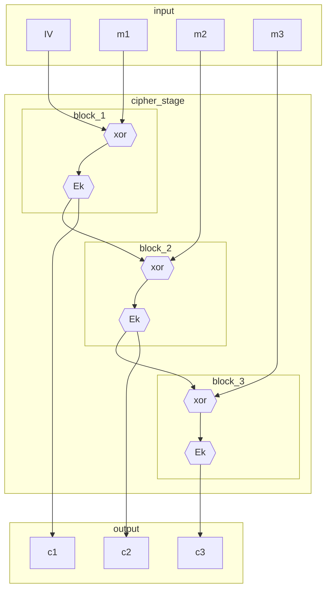

# MODALITÀ DI CIFRATURA

Esistono diverse modalità per l'implementazione di cifrari a blocchi:

## ELECTRONIC CODE BOOK (ECB)

Modalità standard di implementazione dei cifrari a blocchi [CIFRARI A BLOCCHI](CIFRARI_SIMMETRICI.md#CIFRARI%20A%20BLOCCHI) questa si presenta a diverse vulnerabilità tra cui:

- blocchi identici di testo in chiaro producono blocchi identici di testo cifrato
- la cifratura ECB risulta malleabile, e possibile modificare il cifrato per ottenere un decifrato voluto dall'attaccante
- e richiesto l'uso del padding
- e vulnerabile a attacchi attivi

La modalità ECB risulta efficace solo nel caso in cui si ha un **messaggio breve** (*e.g. un blocco*) e **fortemente aleatorio** (*chiave*)

## CIPHER BLOCK CHAINING (CBC)

Modalità di cifratura che prevede di combinare l'output della precedente cifratura con l'input del successivo blocco per mezzo dell'operazione di xor, questo permette di incrementare l' aleatorietà del cifrato.

CBC fa utilizzo di un vettore di inizializzazione per impedire la ripetizione di blocchi cifrati, il vettore $IV$ deve essere usato una sola volta, deve essere casuale e imprevedibile (*proprietà di un [PRNG sicuro](Note%20Domande.md#PRNG%20crittograficamente%20sicuri)*) 

### ECB VS CBC

| ECB                         | CBC                                                             |
| --------------------------- | --------------------------------------------------------------- |
| deterministica              | aleatoria (*se le condizioni sul vettore $IV$ sono rispettate*) |
| parallelizzabile            | non parallelizzabile                                            |
| no propagazione dell'errore | propagazione dell'errore                                        |
| no vettori di init $IV$     | necessario un vettore di init $IV$ noto a entrambe le parti     |

## CIPHER FEEDBACK (CFB) 

Modalità di cifratura che si rifa ai [cifrari a flusso autosincronizzanti](CIFRARI_SIMMETRICI.md#CIFRARI%20A%20FLUSSO) con l'utilizzo di un vettore $IV$  molto adatta alla comunicazione di flussi di dati.
Il flusso di chiave viene ottenuto per mezzo di uno shift register (inizializzato per mezzo di $IV$) che viene cifrato con la chiave concordata

## OUTPUT FEEDBACK (OFB)

Variante del [CFB](#CIPHER%20FEEDBACK%20(CFB))  in cui pero la retroazione non prevede il cifrato al passo precedente ma il flusso di chiave stesso, adatta alla trasmissione in canali rumorosi

## COUNTER (CTR)

Simile a [ECB](#ELECTRONIC%20CODE%20BOOK%20(ECB)), introduce il concetto di aleatorietà per mezzo di un flusso di chiave incrementale generato da un contatore cifrato, inizializzato con un seme

## ATTACCHI A MODALITÀ DI CIFRATURA

### BEAST ATTACK - BROWSER EXPLOIT AGAINST SSL/TLS

Sfrutta l'uso scorretto del vettore di inizializzazione $IV$, nelle implementazioni di SSL/TLS in particolare, vettori prevedibili.

L'attaccante deve essere in grado di prevedere il valore del vettore e iniettare un flusso dati nel mezzo di una comunicazione avviata (*man in the middle*)

In una sessione di comunicazione SSL le due parti negoziano una serie di parametri tra cui la modalità di cifratura della comunicazione, se CBC viene scelta dalle due parti il messaggio viene suddiviso in blocchi e a ognuno di questi viene applicata la cifratura CBC. 

Il vettore $IV$ viene scelto essere il residuo della cifratura CBC del pacchetto precedente, rendendo cosi **deducibile il vettore $IV$** per mezzo di osservazione delle comunicazioni.

L'attacco si svolge cosi, supponiamo che l'attaccante voglia sapere con chi sta comunicando la sorgente:

- ascolta il canale
- e interessato a verificare se al passo $N$ di CBC il testo in chiaro e un determinato valore $m$
- al passo $N+1$ inietta nel canale un blocco residuo $$m \oplus K_1 \oplus K \oplus K_1$$ dove $K,K_1$ sono i residui CBC del passo $N,N+1$
-  per le proprietà dello xor l'attaccante **sa se il messaggio inviato al passo $N$ dalla sorgente e effettivamente quello ipotizzato** 

### BIRTHDAY ATTACKS 64-BIT CIPHER BLOCKS

Attacco che sfrutta la dimensione ridotta (*64 bit*) dei blocchi di testo in chiaro, dato che questa detta il numero di blocchi che sono cifrabili per mezzo della stessa chiave, essendo che la probabilità di collisione tra i blocchi e di $2^{\frac{N}{2}}$ .

Se avviene una collisione l'attaccante può rivelare il contenuto dello xor dei rispettivi messaggi in chiaro, e se riesce a fare ipotesi sul primo messaggio rivelare il contenuto del secondo

$$
\displaylines{
collisione \rightarrow m_i \oplus c_i = m_j \oplus c_j \Rightarrow \\
m_i \oplus m_j = c_i \oplus c_j
}
$$

Per evitare questa vulnerabilità la chiave deve essere cambiata dopo  $2^{\frac{N}{2}}$