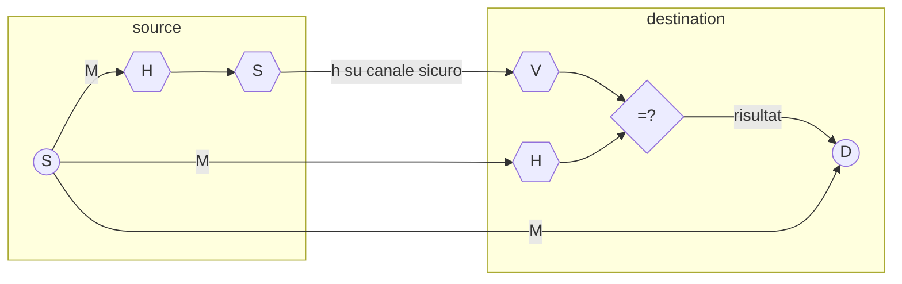
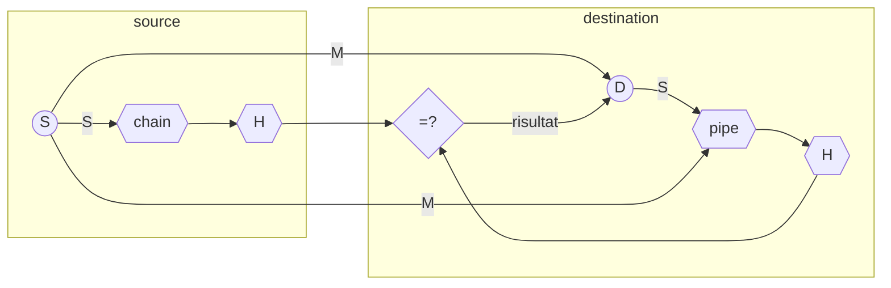

# PROTOCOLLI PER LA SICUREZZA

Esistono diversi protocolli generati dalla combinazione delle [trasformazioni](TRASFORMAZIONI.md) base a seconda delle proprietà che si vogliono garantire:

## FIRMA DIGITALE

Esempio di utilizzo della funzione $S$, in cui la sorgente deve dimostrare che il messaggio inviato proviene da essa stessa, la sorgente invia alla destinazione

$$C = S(H(M))$$

La funzione di sign garantisce che un attaccante non sia in grado di replicare il messaggio mentre la computazione sulla funzione $H$ garantisce un miglioramento delle prestazioni dato che $H(M) \lt M$. Inoltre la funzione $S$ e eseguibile solo dalla sorgente, questo garantisce il non ripudio

## HASH DI UN SEGRETO

In questo schema la sorgente invia $M$ e $H(M|S)$ dove $S$ e un segreto condiviso dalle due parti, la destinazione e in grado di ricalcolare l'hash partendo dal messaggio ricevuto dal canale e dal segreto, a differenza dello schema [di firma digitale](#SCHEMA%20FIRMA%20DIGITALE) qui viene utilizzato solo una trasformazione invece che 2 tuttavia essendo presente un segreto condiviso la **firma risulta ripudiabile in quanto il documento può essere generato sia dalla destinazione che dalla sorgente**

## CIFRATURA DI MESSAGGIO E SEGRETO CONDIVISO

In questo esempio la sorgente invia un messaggio cifrato contenente il messaggio e l'hash di un segreto (*schema utilizzato in SSL*)

$$
c = E(m|H(m|s))
$$

Questa soluzione non può essere considerata una soluzione di autenticazione, e se la cifratura utilizza [chiavi simmetriche](CHIAVI.md) non e considerabile non ripudiabile.
Inoltre questo schema costringe il destinatario a decifrare prima di autenticare il messaggio, che e una caratteristica non sempre desiderabile.

## HASH DI SEGRETO E CIFRATURA DI MESSAGGIO

In questo schema la sorgente invia:

$$
\displaylines{
c= E(m)|H(m|s) \space (es. \space SSH) \\
c= E(m)|H(E(m)|s) \space (es. \space IPSEC) \\
}
$$

In questo modo la destinazione può autenticare un messaggio prima di decifrarlo, tuttavia e necessario che la funzione $H$ sia sicura per impedire all'attaccante di risalire al segreto

 [NEXT](TRASFORMAZIONI.md)
