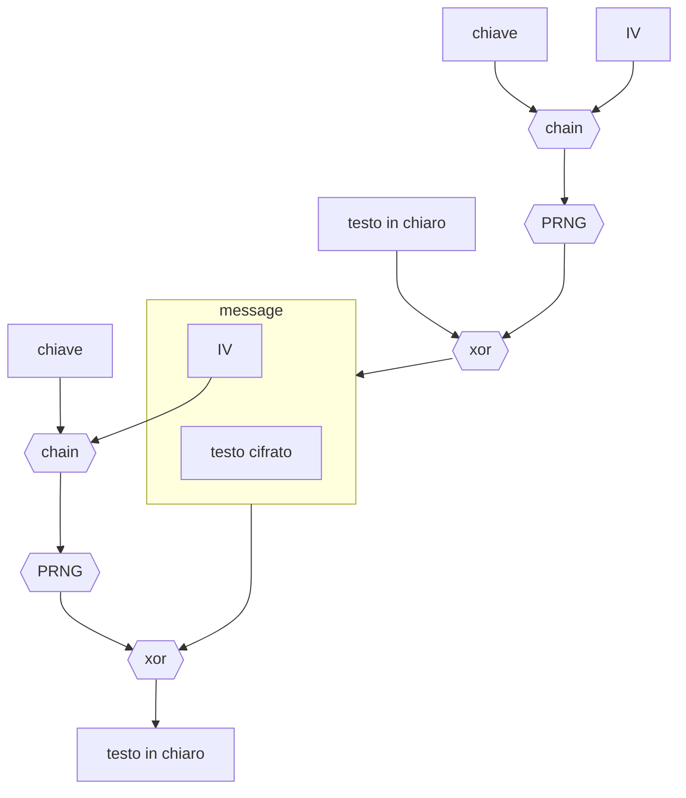

# PROTOCOLLO WEP

Protocollo per la cifratura di testi per mezzo di [cifrari a flusso sincrono](CIFRARI_SIMMETRICI.md#CIFRARI%20A%20FLUSSO)

Questo protocollo soffre del problema di [riutilizzo della chiave](CIFRARI_SIMMETRICI.md#RIUTILIZZO%20DELLE%20CHIAVI) in quanto essa risulta essere la composizione di una parte statica e una dinamica che tuttavia si esaurisce in contesti di comunicazione molto pesanti (*e.g. molti byte da trasferire, comunicazioni wireless*)

Inoltre il cifrario utilizzato risulta **malleabile**, l'attaccante  e in grado di manipolare il testo cifrato in modo tale che in fase di decifrazione la destinazione ottenga un testo voluto dall'attaccante