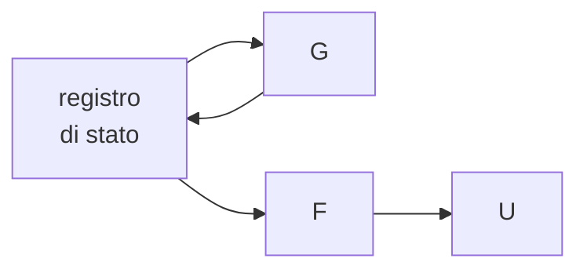
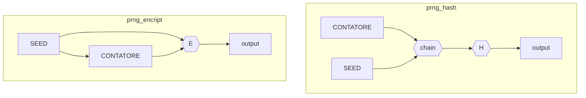

# RANDOM NUMBER GENERATOR (RNG)

Per poter creare chiavi sicure e non deducibili e necessario un componente in grado di generare numeri casuali, l'output di questo componente deve avere le seguenti proprieta:

-   Indipendenza statistica
-   Valori equiprobabili

## STRUMENTI PER LA VERIFICA DI UN RNG

Per verificare la casualità sono stati definiti diversi test statistici. Lo standard FIPS 140-2 prevede su una sequenza di 20000 bit i seguenti test

-   **Monobit** controlla se zeri e uni sono in numero più o meno dello stesso numero
-   **Pocker** divide la sequenza in sotto sequenze di bit di 1 e 0
-   **Run** va a vedere le stringhe consecutive di 1 o 0, va a vedere per le varie lunghezze se il loro numero è pressoché lo stesso, non c'è una prevalenza rispetto ad un\'altra
-   **Long Run**

## TRUE RANDOM NUMBER GENERATOR (TRNG)

Generatore che usa come seme eventi del mondo reale che hanno una casualità intrinseca, tali fenomeni possono essere:

-   **Fenomeni fisici**: decadimento radioattivo, rumore termico, turbolenza di un fluido.
-   **Segnali di apparati elettronici**: microfono, telecamera, oscillatore.
-   **Programmi di estrazione di rumore**: tastiera, mouse, numero di processi attivi, traffico di rete.

### MANCANZE DEL TRNG

Il TRNG presenta una bassa frequenza di generazione, non e utilizzabile pertanto in campo applicativo, inoltre presenta una scarsa riproducibilità tra sorgente e destinazione

## PSEUDO RANDOM NUMBER GENERATOR (PRNG)

Sistemi che utilizzano un seme di piccole dimensioni per generare una sequenza di chiavi con algoritmi deterministici, questi si basano sul calcolo dello stato futuro partendo da uno stato precedente

Questi sistemi soddisfano la casualità e la riproducibilità ma non l' imprevedibilità infatti la sequenza di bit successiva e deducibile a partire da un determinato valore di uscita

## CRYPTOGRAPHICALLY SECURE PSEUDO RANDOM BIT GENERATOR (CSPRNG)

Strumento che rispetta le caratteristiche di **imprevedibilità, casualità e indeducibilità** dell' uscita.

### GARANTIRE L' IMPREVEDIBILITÀ

Per garantire l'imprevedibilità il seguente test deve essere effettuato:

*dati $L$ bit della stringa d'uscita non deve esistere un algoritmo polinomiale in grado di predire il bit $L+1-esimo$ con $probabilità \geq 0.$*

### GARANTIRE L' INDEDUCIBILITÀ

Per garantire l' indeducibilità e necessario che le funzioni $F$ e/o $G$ siano [funzioni one-way](TRASFORMAZIONI.md#COSA%20SERVE%20PER%20RENDERE%20LE%20TRASFORMAZIONI%20SICURE?) queste funzioni possono essere definite con algoritmi simmetrici (*e.g. alte performance*) o asimmetrici (*e.g. unidirezionalità dimostrabile*)

### LINEE GUIDA

Per poter costruire un CSPRNG esistono delle linee guida definite da un RFC che prevedono la combinazione di un [PRNG](#PSEUDO%20RANDOM%20NUMBER%20GENERATOR%20(PRNG)) con un seme generato da un [TRNG](#TRUE%20RANDOM%20NUMBER%20GENERATOR%20(TRNG))

## IMPLEMENTAZIONI DI PRNG SICURI

Le funzioni random dei linguaggi (*e.g. C e java*) non sono utilizzabili in quanto non garantiscono le proprietà necessarie, possibili implementazioni sono realizzabili per mezzo della classe java `secure.random`

 [NEXT](TRASFORMAZIONI.md)
