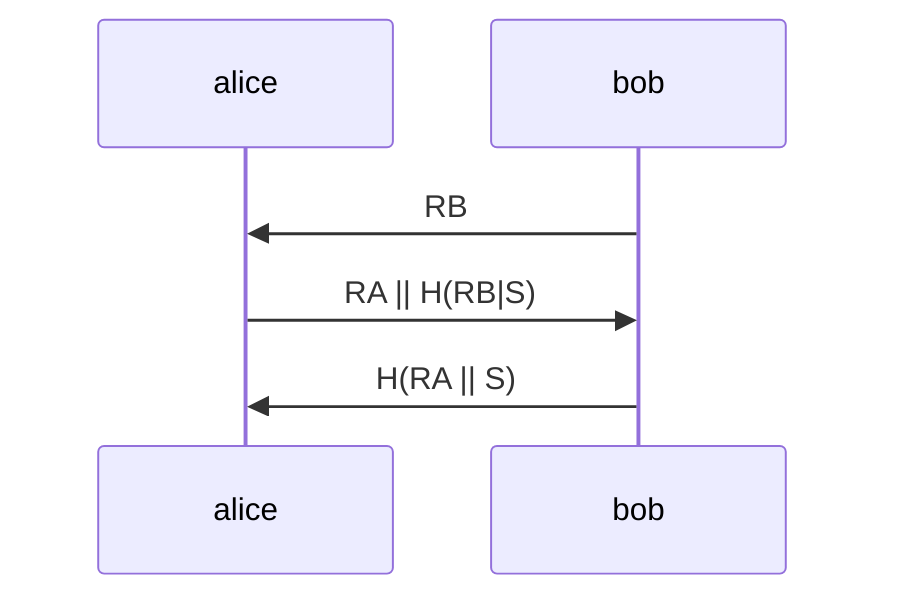
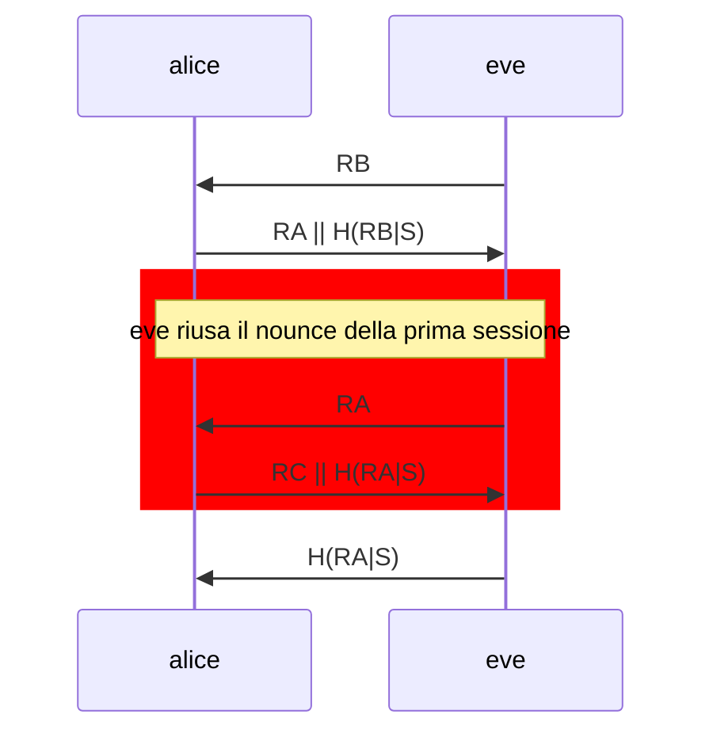

# ATTACCO DI REFLECTION

Attacco attuabile nei protocolli di sfida risposta di tipo simmetrico della forma seguente

In questa tipologia di attacco l'utente malevolo apre due sessioni con alice e sfrutta la seconda sfida come risposta alla prima riproponendo il numero random fornito da alice alla prima sessione

