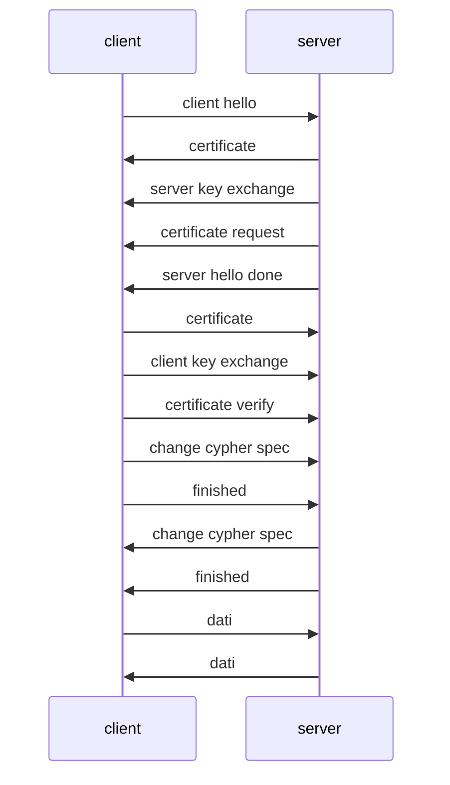

# SECURE SOCKET LAYER (SSL)

Soluzione a livello di trasporto per garantire la confidenzialita, l'autenticita e l'integrita tra due host che intendono comunicare

Nella suite SSL ci sono due protocolli:

- **Protocollo di Handshake**: protocollo di negoziazione
- **Prodotocollo di Record**: che definisce il vero e proprio formato dei messaggi sicuri all’interno di una sessione di sicurezza SSL

## PROTOCOLLO DI HANDSHAKE

Ha come scopo:

- garantisce che i client stia creando una sessione con il server desiderato (*autenticazione del server*)
- permette la negoziazione dei parametri di sicurezza da usare per la comunicazione 

I parametri negoziati hanno validita per un intera sessione di comunicazione

### SESSIONE SSL

Una sessione e caratterizzata da uno stato definito da:

- Identificatore di sessione
- Certificato del peer che partecipa alla sessione, dell’entità che sta partecipando
- Parametri critografici
- Metodo di compressione
- Cifrario ed algoritmo hash (utilizzati per trasformare i dati)
- Segreto principale

### CONNESSIONE SSL

Parametri che definiscono uno stato di una connessione:

- Server rando number (nonce)
- Client random number (nonce)
- Server write MAC secret
- Client write MAC secret
- Server write key
- Client write key
- Initialization vectors
- Sequence number

### MESSAGGI HELLO

In questa fase il client ed il server si dicono cosa sanno fare ed il client autentica il server.

In questi messaggi le informazioni sono le seguenti:

- Versione SSL: client e server devono essere compatibili
    
- Random: client e server generano quantità random diverse per evitare reply;
    
- ID di sessione: in base al valore viene creata una nuova connessione in una sessione esistente, vengono rinegoziati i parametri di una connessione esistente. Inoltre dico in ordine di preferenza gli algoritmi di cifratura e id hash che il client è in grado di supportare, dato che client e server sono in grado di scambiarsi messaggi sicuri sse gli algoritmi (di cifratura, di hash, per concordare la chiave) sono compatibili. Il server andrà a verificare cosa è in grado di fare e restituirà al client l’identificatore della sessione e il sottoinsieme di algoritmi che ha selezionato in ordine di preferenza.

Questi due messaggi hanno l’obiettivo di concordare quali meccanismi verranno utilizzati.

- Suite di cifratura: il client offre una lista di preferenze e il server sceglie
- Metodo di compressione: il client offre una lista di preferenze e il server sceglie

I metodi di scambio possibili sono i seguenti:

- [[RSA]] con cifrario ibrido
- [ALGORITMO DIFFIE-HELLMAN ](KEY_MANAGEMENT.md#ALGORITMO%20DIFFIE-HELLMAN%20(VERSIONE%20ANONIMA)) in tutte le varianti (*da evitare quella anonima*)

### SCAMBIO DEI PARAMETRI

A seconda della modalita di cifratura i peer si scambiano parametri diversi:

- chiavi pubbliche nel caso di cifrari ibridi
- valori $p,g,A$ nel caso di diffie hellman

 Alla fine del protocollo di negoziazione i peer concordano un master secret che verra utilizzato all'interno di una stessa sessione per le comunicazioni, dal master secret si derivano le chiavi utilizzate per ogni connessione

SSL non garantisce il non ripudio dei messaggi  ma solo l'autenticazione del server (*client opzionale*)