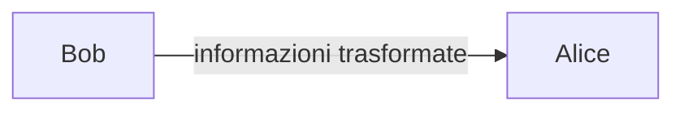
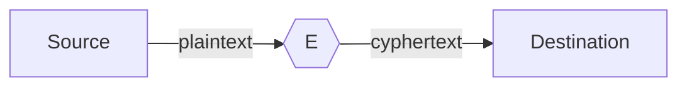
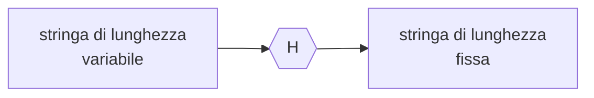
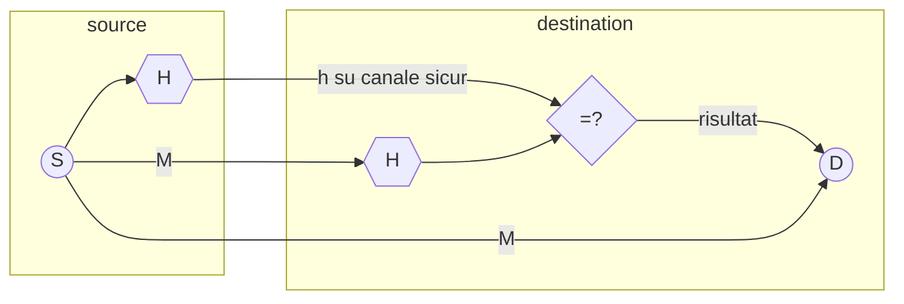
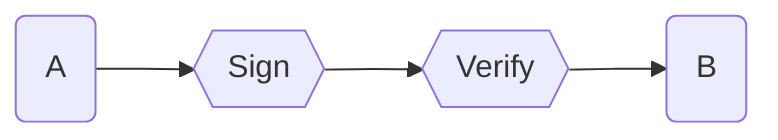
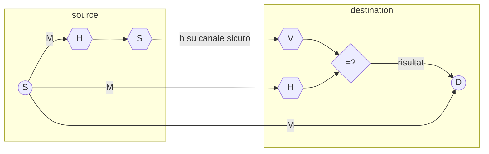

# TRASFORMAZIONI PER LA SICUREZZA

Applicazioni sicure utilizzano metodologie di manipolazione dei dati per comunicarli su un canale insicuro:

## TRASFORMAZIONE $E$

Questa trasformazione prevede che la sorgente alteri le comunicazioni in maniera da renderle irriconoscibili se non dalla sorgente. Il suo compito e quello di mantenere la **riservatezza della comunicazione**

La proprietà fondamentale e che lo sforzo per ripristinare il `plaintext`  dal `cyphertext` deve essere insostenibile per un attaccante

## TRASFORMAZIONE $H$

La trasformazione $H$ ha il compito di preservare **l'integrita di una comunicazione**, la sorgente allega al messaggio un riassunto che consente alla destinazione di comprendere se il messaggio e stato alterato

La trasformazione $H$ deve ridurre al minimo la possibilità di collisioni ovvero:

*se $x,y$ sono stringhe diverse deve essere vero che $H(x) \neq H(y)$* 

questo non e sempre garantito in quanto il dominio di partenza e più grande del dominio di destinazione,Inoltre una funzione $H$ sicura e tale se **risulta molto difficile risalire a due testi che generino una collisione**

### CONTROLLO DI INTEGRITA

## TRASFORMAZIONE $S$

Trasformazione $S$ ha il compito di assicurare **l'autenticità di un messaggio**, la sorgente allega al messaggio informazioni non imitabili e la destinazione verifica che il documento ricevuto sia di chi ha dichiarato di averlo mandato

### SCHEMA FIRMA DIGITALE

## COSA SERVE PER RENDERE LE TRASFORMAZIONI SICURE?

Tutte le funzioni di trasformazione devono essere **one way functions** ovvero:

- essere invertibili
- facili da calcolare
- $\forall \space a \in X$ deve essere difficile risolvere il problema $y=f(x)$ (*e.g. deve essere difficile risalire all input che ha generato un certo valore*)

Nella pratica, tali funzioni possono essere solo approssimate sfruttando problemi difficili della teoria dei numeri o manipolando i dati a livello di bit, in questo caso si parla di funzioni **pseudo-direzionali** (funzioni one-way per chiunque non sia in possesso di un dato segreto) 

## FUNZIONI SEGRETE

Per rendere segreta una funzione si possono sfruttare diversi approcci:

- segretare la macchina
- segretare l'algoritmo
- segretare un parametro

Segretare un parametro e la scelta vincente in quanto gli algoritmi di cifratura sono complessi e necessitano di essere condivisi dalle due parti e segretare la macchina e estremamente costoso si fa dunque uso di [chiavi](CHIAVI.md)